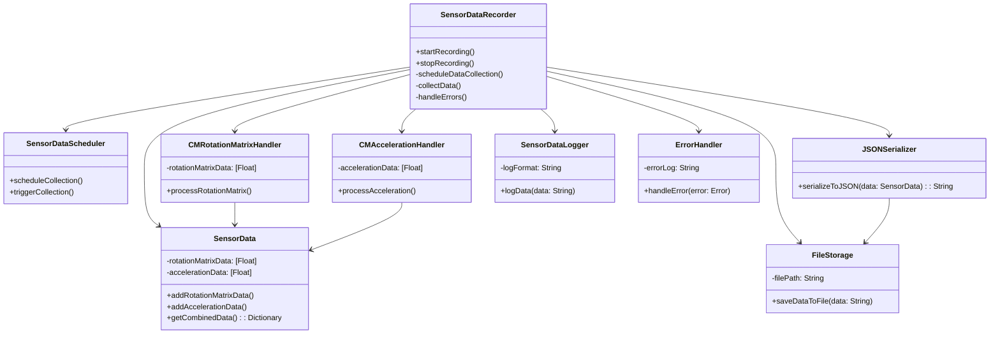

```mermaid
classDiagram
    class SensorDataRecorder {
        +startRecording()
        +stopRecording()
        -scheduleDataCollection()
        -collectData()
        -handleErrors()
    }
    
    class SensorDataScheduler {
        +scheduleCollection()
        +triggerCollection()
    }
    
    class CMRotationMatrixHandler {
        +processRotationMatrix()
        -rotationMatrixData: [Float]
    }
    
    class CMAccelerationHandler {
        +processAcceleration()
        -accelerationData: [Float]
    }
    
    class SensorData {
        +addRotationMatrixData()
        +addAccelerationData()
        +getCombinedData(): Dictionary
        -rotationMatrixData: [Float]
        -accelerationData: [Float]
    }
    
    class JSONSerializer {
        +serializeToJSON(data: SensorData): String
    }
    
    class FileStorage {
        +saveDataToFile(data: String)
        -filePath: String
    }
    
    class SensorDataLogger {
        +logData(data: String)
        -logFormat: String
    }
    
    class ErrorHandler {
        +handleError(error: Error)
        -errorLog: String
    }

    SensorDataRecorder --> SensorDataScheduler
    SensorDataRecorder --> CMRotationMatrixHandler
    SensorDataRecorder --> CMAccelerationHandler
    SensorDataRecorder --> SensorData
    SensorDataRecorder --> JSONSerializer
    SensorDataRecorder --> FileStorage
    SensorDataRecorder --> SensorDataLogger
    SensorDataRecorder --> ErrorHandler

    CMRotationMatrixHandler --> SensorData
    CMAccelerationHandler --> SensorData
    JSONSerializer --> FileStorage
```