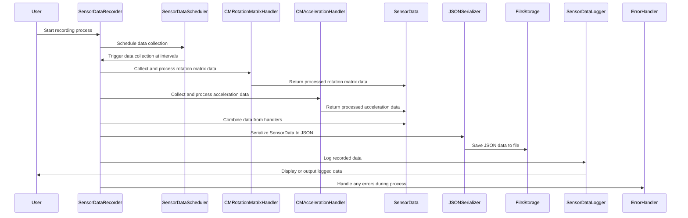

```mermaid
sequenceDiagram
    participant User
    participant SensorDataRecorder
    participant SensorDataScheduler
    participant CMRotationMatrixHandler
    participant CMAccelerationHandler
    participant SensorData
    participant JSONSerializer
    participant FileStorage
    participant SensorDataLogger
    participant ErrorHandler

    User ->> SensorDataRecorder: Start recording process
    SensorDataRecorder ->> SensorDataScheduler: Schedule data collection
    SensorDataScheduler ->> SensorDataRecorder: Trigger data collection at intervals
    
    SensorDataRecorder ->> CMRotationMatrixHandler: Collect and process rotation matrix data
    CMRotationMatrixHandler ->> SensorData: Return processed rotation matrix data
    
    SensorDataRecorder ->> CMAccelerationHandler: Collect and process acceleration data
    CMAccelerationHandler ->> SensorData: Return processed acceleration data
    
    SensorDataRecorder ->> SensorData: Combine data from handlers
    
    SensorDataRecorder ->> JSONSerializer: Serialize SensorData to JSON
    JSONSerializer ->> FileStorage: Save JSON data to file
    
    SensorDataRecorder ->> SensorDataLogger: Log recorded data
    SensorDataLogger ->> User: Display or output logged data
    
    SensorDataRecorder ->> ErrorHandler: Handle any errors during process
```